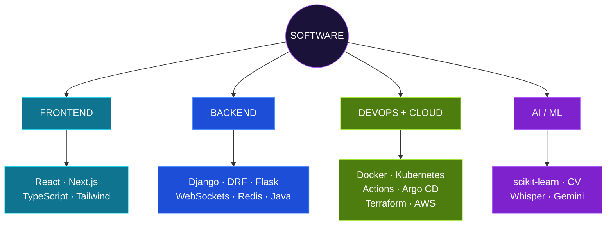

<div align="center">


**Build the app. Automate the delivery. Codify the infrastructure.**

<table>
<tr>
<td align="center"><a href="#about"><kbd> ABOUT </kbd></a></td>
<td align="center"><a href="#projects"><kbd> PROJECTS </kbd></a></td>
<td align="center"><a href="#stack"><kbd> STACK </kbd></a></td>
<td align="center"><a href="#experience"><kbd> EXPERIENCE </kbd></a></td>
<td align="center"><a href="#achievements"><kbd> ACHIEVEMENTS </kbd></a></td>
<td align="center"><a href="#contact"><kbd> CONTACT </kbd></a></td>
</tr>
</table>

</div>

<a id="about"></a>

```text
gaurav@github:~$ profile --summary

  name     → Gaurav Sharad Bansod
  role     → software developer
  focus    → full-stack · devops · cloud
  ai       → applied: voice pipeline, churn prediction, sentiment analysis
  school   → VIT Bhopal University · B.Tech CSE · expected 2027 · GPA 7.86/10
  status   → building
```

[`whoami`](#about) · [`projects`](#projects) · [`stack`](#stack) · [`experience`](#experience) · [`achievements`](#achievements) · [`contact`](#contact)

> I build software across the stack: Django and Next.js applications, the pipelines that ship them, and the AWS infrastructure they run on. AI shows up as a feature inside those systems, such as a live voice onboarding flow, rather than as a separate identity.


## What I build


| Layer | Tools |
|---|---|
| Applications, APIs, data | Django · DRF · Next.js · React · WebSockets · Redis · MySQL · MongoDB · Java Swing |
| Containers, delivery | Docker · Kubernetes · GitHub Actions · Trivy · Argo CD |
| Cloud | AWS · Terraform · VPC · IAM |
| Intelligent features | faster-Whisper · Gemini 2.0 Flash · scikit-learn · sentiment analysis |


<a id="projects"></a>

## Featured projects

<table>
<tr><td>

### 🎙️ NITIGATI
**AI-powered freelance service marketplace** · [Repository →](https://github.com/Gauravb741/NITIGATI)

</td></tr>
<tr><td align="center"></td></tr>
<tr><td>

**Stack:** `Django REST Framework` `Next.js 16` `TypeScript` `Tailwind CSS v4` `Django Channels` `Daphne` `Redis` `faster-Whisper` `Gemini 2.0 Flash` `Edge TTS`

**Purpose →** A two-sided marketplace where Providers offer services and Customers discover, negotiate and order them.
**Built →** Token auth, dual-role workflows, tag-based discovery, proposal negotiation, order lifecycle, real-time Provider–Customer chat.
**How it works →** A provider speaks; faster-Whisper transcribes, Gemini 2.0 Flash extracts structured profile fields, and Edge TTS asks follow-up questions until every field is captured.
**Why it's interesting →** Speech, LLM extraction and chat all run in real time over one WebSocket layer.

</td></tr>
</table>

<table>
<tr><td>

### 🔁 GitOps Kubernetes Deployer
**CI/CD with quality gates, deployed by Git state** · [Repository →](https://github.com/Gauravb741/gitops-kubernetes-deployer)

</td></tr>
<tr><td align="center"></td></tr>
<tr><td>

**Stack:** `GitHub Actions` `Docker` `Trivy` `Kubernetes` `Argo CD`

**Purpose →** Take code from commit to a running workload with no manual deployment steps.
**Built →** Sequential pipeline stages (build, unit tests, image, security scan) that act as gates before deployment.
**How it works →** Argo CD syncs the cluster from Git, with self-healing, zero-downtime rolling updates and automated rollback on failed health checks.
**Why it's interesting →** Deployment is driven by Git, not by someone running commands.

<details>
<summary>🔍 Technical deep dive</summary>

- Kubernetes Deployments, Services, ConfigMaps and Secrets
- Health checks trigger automated rollback
- Trivy container scanning enforced as part of the pipeline

</details>

</td></tr>
</table>

<table>
<tr><td>

### ☁️ Terraform AWS Infrastructure Automation
**Modular AWS infrastructure as code** · [Repository →](https://github.com/Gauravb741/tf-aws-infra)

</td></tr>
<tr><td align="center"></td></tr>
<tr><td>

**Stack:** `Terraform` `AWS` `VPC` `EC2 Auto Scaling` `S3` `IAM`

**Purpose →** Provision repeatable, multi-environment AWS infrastructure without manual steps.
**Built →** Modular Terraform for VPC, EC2 auto-scaling groups, S3, IAM roles/policies and security groups.
**How it works →** The full lifecycle (plan, validate, apply, destroy) is automated for consistent environments.
**Why it's interesting →** Least-privilege IAM and standardized network access controls are part of the code, not an afterthought.

</td></tr>
</table>

<table>
<tr><td>

### 🛡️ Online Examination & Proctoring System
**Desktop exam app that detects and acts on violations** · [Repository →](https://github.com/Gauravb741/Online-Examination-and-Proctoring-System)

</td></tr>
<tr><td>

**Stack:** `Core Java` `Java Swing` `JSON / text storage`

```text
focus lost → timestamped violation logged → 3+ violations → auto-submit
timer expires (separate thread) → auto-terminate
gui / model / service / storage / util   ← MVC package layout
```

**Purpose →** Run exams with role-based Admin/Student access and basic proctoring, with no external database or server.
**Built →** Focus-loss detection, violation log, multithreaded countdown timer, MCQ navigation, answer flagging, result persistence, admin panel for questions and results.
**Why it's interesting →** Concurrency, event handling and custom exceptions in plain Java, structured as MVC.

</td></tr>
</table>

**Also:** [CAPE — Online Examination Management Platform](https://github.com/Gauravb741/CAPE) · `Django REST Framework` `React.js` `MongoDB` `Chart.js` `pandas` · Admin/Student portals and REST APIs for scheduling, student records and study material.


<a id="stack"></a>

## Stack

| | |
|---|---|
| **Languages** | <br>Python · Java · Bash / Shell |
| **Full stack** | <br>Django · DRF · Flask · React · Next.js · TypeScript · Tailwind · REST · WebSockets · Redis · Chart.js |
| **DevOps & cloud** | <br>Docker · Kubernetes · GitHub Actions · CI/CD · Argo CD · GitOps · Terraform · AWS · Trivy · Prometheus · Grafana · Linux · Networking |
| **AI / ML** | <br>Machine Learning · Computer Vision · scikit-learn · Data Preprocessing · Sentiment Analysis |
| **Databases** | <br>MySQL · MongoDB · JDBC |
| **Core CS** | OOP · Data Structures & Algorithms · Collections · Multithreading · Exception Handling |



<a id="experience"></a>

## Experience

```text
2027  ┤  B.Tech CSE graduation (expected) · VIT Bhopal University
      │
2026  ┤  May–Jul · MPonline Ltd. · Advanced Software Engineering & Development Intern
      │             └─ Library Management System (Java, MVC: cataloging, borrowing, returns)
      │
      ┤  May–Jul · MPonline Ltd. · AI / ML Intern
      │             └─ Smart Customer Retail System (Python): churn-prediction model,
      │                review sentiment-analysis pipeline, conversational chatbot,
      │                each trained and tested as an independent component
      │
2025  ┤  Jul · Self-published "Words Fallen Wrong" (Pothi.com)
```

<a id="achievements"></a>

## Achievements

<table>
<tr>
<td align="center" width="33%">🏆<br><b>IEEE Ideathon</b><br>1st place · IEEE Club</td>
<td align="center" width="33%">🎖️<br><b>Patent granted</b><br>In-Display Fingerprint Mouse<br>Design No. 434354-001</td>
<td align="center" width="33%">📖<br><b>Author</b><br>"Words Fallen Wrong"<br>Pothi.com · July 2025</td>
</tr>
</table>

## Certifications

<table>
<tr>
<td align="center" width="33%"><b>Google IT Support</b><br>Professional Certificate<br>Google / Credly</td>
<td align="center" width="33%"><b>Bits and Bytes of<br>Computer Networking</b><br>Coursera / Google</td>
<td align="center" width="33%"><b>AWS Cloud Practitioner</b><br>Intellipaat</td>
</tr>
<tr>
<td align="center"><b>AWS Solutions Architecture</b><br>Forage</td>
<td align="center"><b>Machine Learning</b><br>NPTEL / IIT</td>
<td align="center"><b>Programming in Java</b><br>VITyarthi</td>
</tr>
</table>


```text
$ cat /etc/gaurav

  loop       = build → engineer → automate → deploy → improve
  deploys    = driven by Git
  pipelines  = gated: tests → security scan → deploy
  infra      = codified
  ai         = a feature inside the system
```

<a id="contact"></a>

## Contact

```text
$ systemctl status gaurav

● gaurav.service - software developer
     Active: active (building)
      Focus: interesting software problems
```

<div align="center">

[GitHub](https://github.com/Gauravb741) · [LinkedIn](https://linkedin.com/in/gauravbansod) · [Portfolio](YOUR_PORTFOLIO_URL) · [Email](mailto:gauravbansod680@gmail.com)

</div>
