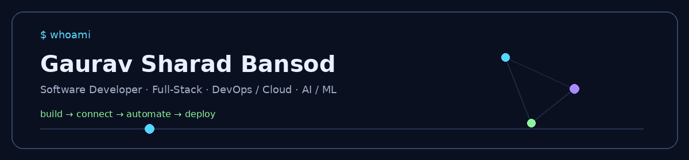
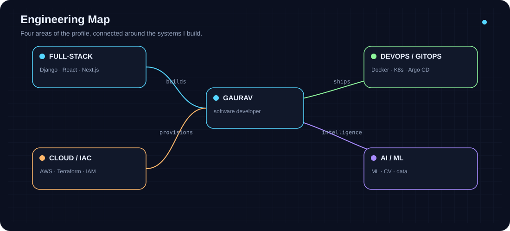
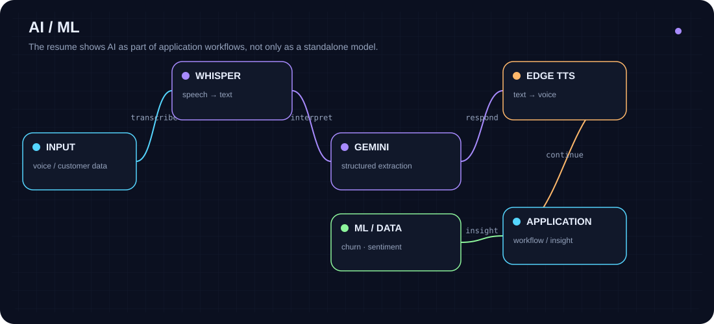
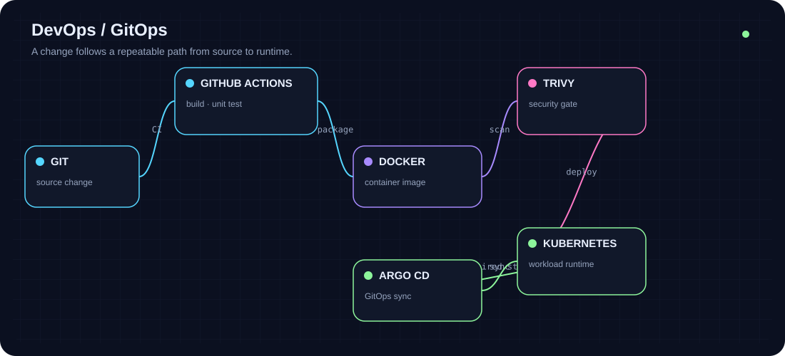
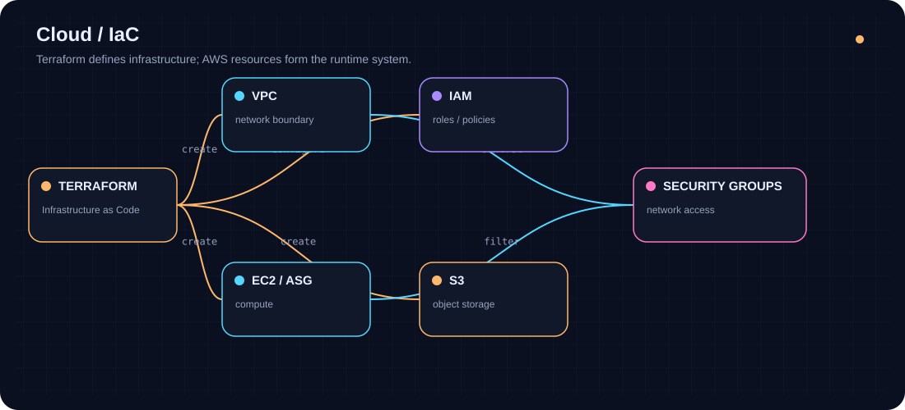
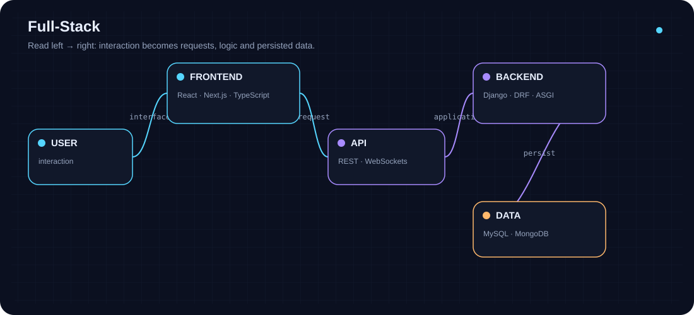
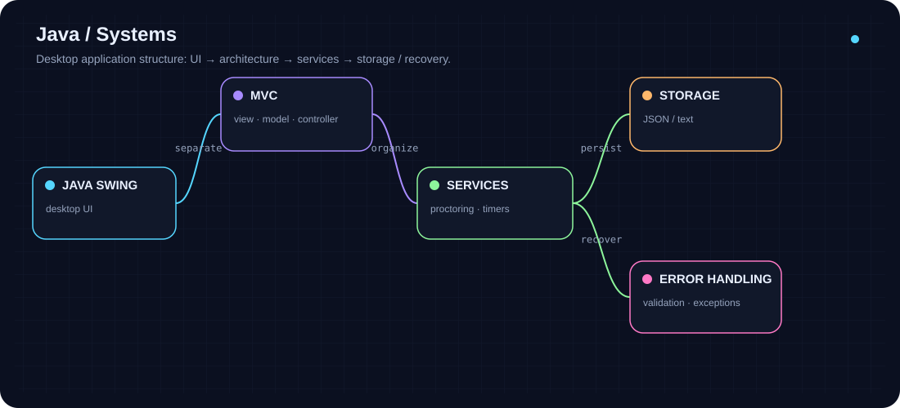
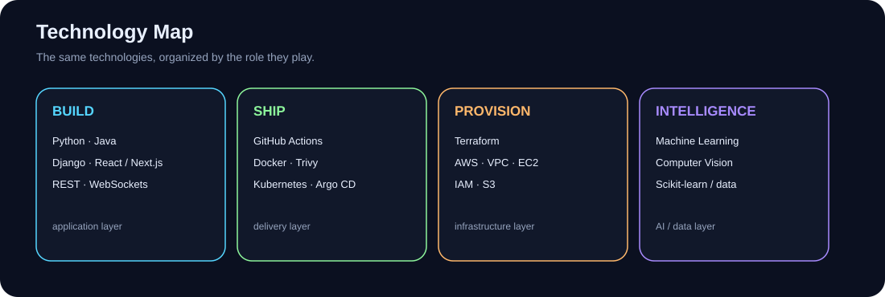

### `BUILD` · `CONNECT` · `AUTOMATE` · `DEPLOY`

[Engineering Map](#engineering-map) · [Selected Work](#selected-work) · [Technology Map](#technology-map) · [Experience](#experience) · [Milestones](#milestones) · [Connect](#connect)

---

## About

I’m **Gaurav Sharad Bansod**, a B.Tech Computer Science and Engineering student at **VIT Bhopal University**, expected to graduate in 2027.

I build across the application and infrastructure layers: full-stack systems, automated delivery pipelines, cloud infrastructure, and AI/ML workflows.

> **The goal:** understand how the pieces connect, not just collect the tools.

---

## Engineering Map

A visual overview of the areas represented in my projects:

---

# Selected Work

## 01 · NITIGATI

**AI-Powered Freelance Service Marketplace**

Django REST Framework + Next.js 16 + TypeScript, with Provider/Customer workflows, service discovery, proposal negotiation, order lifecycle, real-time chat, and AI voice onboarding.

**Stack:** Django REST Framework · Next.js · TypeScript · Django Channels · WebSockets · Redis · faster-Whisper · Gemini 2.0 Flash · Microsoft Edge TTS

[View repository →](https://github.com/Gauravb741/NITIGATI)

---

## 02 · GitOps Kubernetes Deployer

**From a Git change to an automated Kubernetes deployment**

The project connects source changes to build/test, containerization, security scanning and GitOps synchronization.

**Stack:** GitHub Actions · Docker · Trivy · Kubernetes · Argo CD · GitOps

[View repository →](https://github.com/Gauravb741/gitops-kubernetes-deployer)

---

## 03 · Terraform AWS Infrastructure Automation

**Infrastructure represented as code**

Terraform provisions the infrastructure described in the project: VPC, EC2 / Auto Scaling, S3, IAM and security groups.

**Lifecycle:** `plan → validate → apply → destroy`

[View repository →](https://github.com/Gauravb741/tf-aws-infra)

---

## 04 · CAPE

**Online Examination Management Platform**

A full-stack examination platform using Django REST Framework, React.js and MongoDB, with role-based Admin/Student portals, exam scheduling, student records, study material and analytics.

[View repository →](https://github.com/Gauravb741/CAPE)

---

## 05 · Java Examination & Proctoring System

**Desktop systems engineering**

The Java-focused resume variant documents a Core Java + Java Swing examination/proctoring application using MVC, multithreading, JSON/text storage, proctoring events and exception handling.

[View repository →](https://github.com/Gauravb741/Online-Examination-and-Proctoring-System)

---

# Technology Map

Instead of a wall of badges, here is what the stack is doing:

### BUILD
Python · Java · Bash / Shell  
Django · Django REST Framework · React.js · Next.js · TypeScript  
REST APIs · WebSockets

### SHIP
Git · GitHub · GitHub Actions  
Docker · Trivy · Kubernetes · Argo CD · GitOps

### PROVISION
Terraform · AWS · Linux · Networking  
VPC · EC2 / Auto Scaling · S3 · IAM · Security Groups

### INTELLIGENCE
Machine Learning · Computer Vision · Scikit-learn · Data Preprocessing · Sentiment Analysis

### DATA
MySQL · MongoDB

---

# Stack Deep Dive

## Full-Stack

**How to read it:** UI creates the interaction → API carries the request → backend applies logic → data is persisted.

## DevOps / GitOps

**How to read it:** source change → checks → package → security gate → runtime → desired-state synchronization.

## Cloud / IaC

**How to read it:** Terraform describes resources and relationships → AWS provides the infrastructure → IAM and network rules control access.

## AI / ML

**How to read it:** input → processing / model → structured result → application behavior.

---

# Experience

**MPOnline Ltd. — Advanced Software Engineering & Development Internship**  
*May 2026 – July 2026*

Built a Library Management System using MVC for cataloguing, borrowing and return workflows.

**MPOnline Ltd. — AI / ML Internship**  
*May 2026 – July 2026*

Developed a Smart Customer Retail System in Python with separate churn-prediction, customer-review sentiment-analysis and conversational-chatbot components.

---

# Education

**VIT Bhopal University**  
B.Tech in Computer Science and Engineering · Expected 2027  
**GPA: 7.86 / 10.0**

---

# Milestones

| Achievement | Detail |
|---|---|
| **Patent** | *In-Display Fingerprint Mouse* — Design No. 434354-001 |
| **IEEE Ideathon** | 1st place |
| **Book** | *WORDS FALLEN WRONG* — self-published, July 2025 |

---

# Certifications

Google IT Support Professional Certificate · The Bits and Bytes of Computer Networking · AWS Cloud Practitioner Certification · Machine Learning · AWS Solutions Architecture Forage · Programming in Java

---

# Connect

[GitHub](https://github.com/Gauravb741) · [LinkedIn](https://linkedin.com/in/gauravbansod) · [Email](mailto:gauravbansod680@gmail.com)

