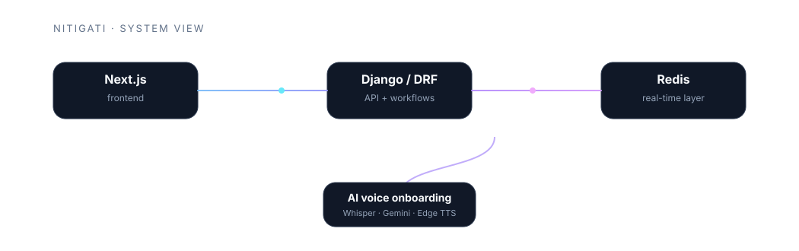
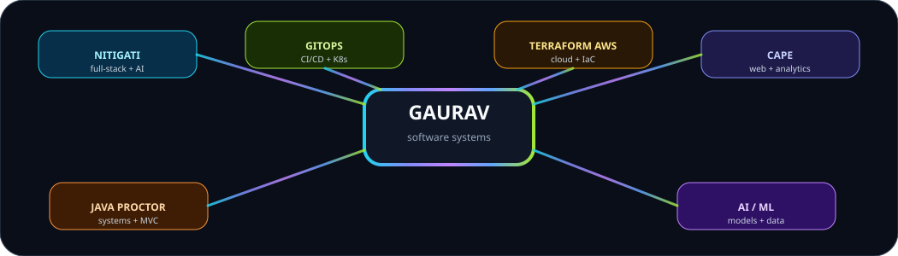

<!-- =========================================================
     GAURAV SHARAD BANSOD — GitHub Profile README
     Designed for github.com/Gauravb741/Gauravb741
     ========================================================= -->

<div align="center">
  
</div>

<br />

<div align="center">
  <a href="#about">ABOUT</a>
  &nbsp;•&nbsp;
  <a href="#engineering-focus">ENGINEERING</a>
  &nbsp;•&nbsp;
  <a href="#featured-work">PROJECTS</a>
  &nbsp;•&nbsp;
  <a href="#tech-stack">STACK</a>
  &nbsp;•&nbsp;
  <a href="#experience">EXPERIENCE</a>
  &nbsp;•&nbsp;
  <a href="#milestones">MILESTONES</a>
  &nbsp;•&nbsp;
  <a href="#connect">CONNECT</a>
</div>

<br />

<div align="center">
  <a href="https://github.com/Gauravb741"></a>
  <a href="https://linkedin.com/in/gauravbansod"></a>
  <a href="mailto:gauravbansod680@gmail.com"></a>
</div>

<br />

<div align="center">
  <sub>BUILD</sub> <strong>→</strong> <sub>AUTOMATE</sub> <strong>→</strong> <sub>DEPLOY</sub> <strong>→</strong> <sub>EXPERIMENT</sub>
</div>

<br />

## <a name="about"></a>◈ ABOUT

<table>
<tr>
<td width="62%" valign="top">

### `gaurav@github:~$ whoami`

I’m **Gaurav Sharad Bansod**, a B.Tech Computer Science and Engineering student at **VIT Bhopal University**, graduating in 2027.

I build across the software lifecycle — from **applications and APIs** to **CI/CD, containers, cloud infrastructure, and AI/ML systems**.

My strongest work sits where application engineering meets automation and deployment: full-stack systems, GitOps pipelines, AWS infrastructure, and AI-powered workflows.

</td>
<td width="38%" valign="top">

### `system.status`

```text
┌─────────────────────────┐
│ developer.profile       │
├─────────────────────────┤
│ role     software dev   │
│ degree   B.Tech CSE     │
│ grad     2027           │
│ GPA      7.86 / 10      │
│ focus    systems + apps │
└─────────────────────────┘
```

</td>
</tr>
</table>

## <a name="engineering-focus"></a>⚡ ENGINEERING FOCUS

<div align="center">
  
</div>

<table>
<tr>
<td width="25%" align="center"><strong>01<br />BUILD</strong><br /><sub>Full-stack apps<br />REST APIs<br />Real-time flows</sub></td>
<td width="25%" align="center"><strong>02<br />AUTOMATE</strong><br /><sub>GitHub Actions<br />CI/CD<br />Security gates</sub></td>
<td width="25%" align="center"><strong>03<br />DEPLOY</strong><br /><sub>Docker<br />Kubernetes<br />GitOps / AWS</sub></td>
<td width="25%" align="center"><strong>04<br />EXPERIMENT</strong><br /><sub>AI / ML<br />Computer Vision<br />Data workflows</sub></td>
</tr>
</table>

## <a name="featured-work"></a>🚀 FEATURED WORK

### `01 // NITIGATI`

<table>
<tr>
<td width="56%" valign="top">

**AI-Powered Freelance Service Marketplace**

A full-stack marketplace with role-based workflows, service discovery, proposal negotiation, order lifecycle management, real-time communication, and an AI voice onboarding pipeline.

**Stack**

`Django REST Framework` `Next.js 16` `TypeScript` `Tailwind CSS` `Daphne/ASGI` `WebSockets` `Redis` `faster-Whisper` `Gemini 2.0 Flash` `Edge TTS`

**What stands out**

- Provider / Customer role architecture
- Token authentication
- Real-time WebSocket communication
- AI speech-to-text → structured field extraction → text-to-speech flow
- Redis channel layers for live chat

<a href="https://github.com/Gauravb741/NITIGATI"><strong>↗ VIEW SOURCE</strong></a>

</td>
<td width="44%" align="center" valign="middle">
  
</td>
</tr>
</table>

<details>
<summary><strong>🧠 NITIGATI — technical flow</strong></summary>
<br />

```text
                         ┌────────────────────┐
                         │     Next.js UI     │
                         └─────────┬──────────┘
                                   │
                         ┌─────────▼──────────┐
                         │ Django REST API    │
                         └─────────┬──────────┘
                                   │
                    ┌──────────────┴──────────────┐
                    │                             │
             ┌──────▼──────┐               ┌──────▼──────┐
             │   Domain    │               │  Channels   │
             │  Workflows  │               │ WebSockets  │
             └─────────────┘               └──────┬──────┘
                                                   │
                                             ┌─────▼─────┐
                                             │   Redis   │
                                             └───────────┘

AI Voice:
Microphone → faster-Whisper → Gemini → structured fields → Edge TTS
```

</details>

<br />

### `02 // GITOPS KUBERNETES DEPLOYER`

<table>
<tr>
<td width="44%" align="center" valign="middle">
  
</td>
<td width="56%" valign="top">

**Automated CI/CD + GitOps Deployment**

A production-style deployment workflow that turns a Git push into a tested, scanned, containerized Kubernetes deployment.

**Stack**

`GitHub Actions` `Docker` `Trivy` `Kubernetes` `Argo CD` `GitOps`

**What stands out**

- Build → unit test → Docker → security scan quality gates
- Kubernetes Deployments and Services
- ConfigMaps and Secrets
- Health checks and automated rollback
- Self-healing and rolling updates
- GitOps synchronization through Argo CD

<a href="https://github.com/Gauravb741/gitops-kubernetes-deployer"><strong>↗ VIEW SOURCE</strong></a>

</td>
</tr>
</table>

<details>
<summary><strong>⚙ Deployment pipeline</strong></summary>
<br />

```text
GIT PUSH
   │
   ▼
GitHub Actions
   │
   ├── Build
   ├── Unit Test
   ├── Docker Image
   └── Trivy Scan
          │
       QUALITY GATE
          │
          ▼
     Kubernetes
          │
       Argo CD
          │
       GitOps Sync
          │
          ▼
  Rolling Deployment
```

</details>

<br />

### `03 // TERRAFORM AWS INFRASTRUCTURE`

<table>
<tr>
<td width="56%" valign="top">

**Infrastructure as Code for AWS**

Modular AWS infrastructure managed through Terraform, covering networking, compute, storage, IAM, and access controls.

**Stack**

`Terraform` `AWS` `VPC` `EC2` `Auto Scaling` `S3` `IAM` `Security Groups`

**What stands out**

- Infrastructure as Code
- Reproducible environments
- Terraform plan / validate / apply / destroy lifecycle
- Least-privilege IAM policies
- Standardized network access controls

<a href="https://github.com/Gauravb741/tf-aws-infra"><strong>↗ VIEW SOURCE</strong></a>

</td>
<td width="44%" align="center" valign="middle">
  
</td>
</tr>
</table>

<br />

### `04 // CAPE`

<table>
<tr>
<td width="44%" align="center" valign="middle">
  
</td>
<td width="56%" valign="top">

**Online Examination Management Platform**

A full-stack examination platform with separate Admin / Student workflows, REST APIs, study materials, scheduling, records, analytics, and data processing.

**Stack**

`Django REST Framework` `React.js` `MongoDB` `REST APIs` `Chart.js` `pandas`

<a href="https://github.com/Gauravb741/CAPE"><strong>↗ VIEW SOURCE</strong></a>

</td>
</tr>
</table>

<br />

### `05 // ONLINE EXAMINATION & PROCTORING SYSTEM`

A Core Java desktop application using **Java Swing**, **MVC**, multithreading, file-based persistence, role-based access, timed examinations, violation logging, and automated submission logic.

<a href="https://github.com/Gauravb741/Online-Examination-and-Proctoring-System"><strong>↗ VIEW SOURCE</strong></a>

## 🧩 PROJECT MAP

<div align="center">
  
</div>

<table>
<tr>
<th>PROJECT</th>
<th>PRIMARY SIGNAL</th>
<th>CORE TECHNOLOGIES</th>
</tr>
<tr>
<td><a href="https://github.com/Gauravb741/NITIGATI">NITIGATI</a></td>
<td>Full-Stack + AI + Real-Time</td>
<td>Django, Next.js, WebSockets, Redis</td>
</tr>
<tr>
<td><a href="https://github.com/Gauravb741/gitops-kubernetes-deployer">GitOps Kubernetes Deployer</a></td>
<td>CI/CD + Kubernetes + GitOps</td>
<td>GitHub Actions, Docker, Trivy, K8s, Argo CD</td>
</tr>
<tr>
<td><a href="https://github.com/Gauravb741/tf-aws-infra">Terraform AWS Infrastructure</a></td>
<td>Cloud + IaC</td>
<td>Terraform, AWS, VPC, EC2, IAM, S3</td>
</tr>
<tr>
<td><a href="https://github.com/Gauravb741/CAPE">CAPE</a></td>
<td>Full-Stack Application Engineering</td>
<td>DRF, React, MongoDB, Chart.js</td>
</tr>
<tr>
<td><a href="https://github.com/Gauravb741/Online-Examination-and-Proctoring-System">Online Examination & Proctoring</a></td>
<td>Java + Systems</td>
<td>Core Java, Swing, MVC, Multithreading</td>
</tr>
</table>

## <a name="tech-stack"></a>🛠 TECH STACK

<div align="center">
  
</div>

<table>
<tr>
<td width="25%" align="center"><strong>LANGUAGES</strong><br /><br />Python<br />Java<br />Bash / Shell</td>
<td width="25%" align="center"><strong>FULL-STACK</strong><br /><br />Django<br />Django REST Framework<br />Next.js<br />React.js<br />TypeScript<br />REST APIs<br />WebSockets<br />Tailwind CSS</td>
<td width="25%" align="center"><strong>DEVOPS / CLOUD</strong><br /><br />Docker<br />Kubernetes<br />GitHub Actions<br />Argo CD<br />Terraform<br />AWS<br />Linux<br />Git<br />Trivy<br />Prometheus<br />Grafana<br />Networking</td>
<td width="25%" align="center"><strong>AI / DATA</strong><br /><br />Machine Learning<br />Computer Vision<br />Scikit-learn<br />Data Preprocessing<br />Sentiment Analysis<br />MySQL<br />MongoDB</td>
</tr>
</table>

## 🎛 `gaurav.os` — SYSTEM VIEW

```text
┌──────────────────────────────────────────────────────────────────┐
│ GAURAV.OS                                                        │
├──────────────────────────────────────────────────────────────────┤
│                                                                  │
│  SOFTWARE            CLOUD             AI / DATA                 │
│  ─────────            ─────             ─────────                 │
│  Django               AWS               Machine Learning          │
│  DRF                  Terraform         Computer Vision           │
│  React                Docker            Scikit-learn              │
│  Next.js              Kubernetes        Data Processing           │
│  APIs                 Argo CD           Sentiment Analysis        │
│                                                                  │
│  delivery:  Git → CI/CD → Container → GitOps → Cloud             │
│                                                                  │
└──────────────────────────────────────────────────────────────────┘
```

## <a name="experience"></a>💼 EXPERIENCE

<table>
<tr>
<td width="18%" align="center"><strong>2026</strong><br /><sub>MAY → JUL</sub></td>
<td width="82%"><strong>MPonline Ltd.</strong><br /><strong>Advanced Software Engineering & Development Internship</strong><br /><sub>Built a Library Management System using the MVC pattern for cataloguing, borrowing and return workflows.</sub></td>
</tr>
<tr>
<td width="18%" align="center"><strong>2026</strong><br /><sub>MAY → JUL</sub></td>
<td width="82%"><strong>MPonline Ltd.</strong><br /><strong>AI / ML Internship</strong><br /><sub>Developed a Smart Customer Retail System in Python covering churn prediction, sentiment analysis and a conversational chatbot.</sub></td>
</tr>
</table>

## <a name="milestones"></a>🏁 MILESTONES

<table>
<tr>
<td width="33%" align="center">
<h3>◈ PATENT</h3>
<strong>In-Display Fingerprint Mouse</strong><br />
<sub>Design No. 434354-001</sub>
</td>
<td width="33%" align="center">
<h3>★ 1ST PLACE</h3>
<strong>IEEE Ideathon</strong><br />
<sub>IEEE Club</sub>
</td>
<td width="33%" align="center">
<h3>✦ AUTHOR</h3>
<strong>WORDS FALLEN WRONG</strong><br />
<sub>Self-published • July 2025</sub>
</td>
</tr>
</table>

## 📜 CERTIFIED / LEARNING

`Google IT Support Professional Certificate` &nbsp; `The Bits and Bytes of Computer Networking` &nbsp; `AWS Cloud Practitioner Certification` &nbsp; `Machine Learning — NPTEL / IIT`

## 🔍 TECHNICAL DEEP-DIVE

<details>
<summary><strong>View the engineering themes behind the repositories</strong></summary>
<br />

### Application engineering

Full-stack applications, REST APIs, role-based workflows, real-time communication, data processing and analytics.

### Delivery engineering

Automated CI/CD workflows with testing, containerization, security scanning, Kubernetes deployment and GitOps synchronization.

### Cloud engineering

Terraform-managed AWS infrastructure with VPC, compute, storage, IAM and security controls.

### Intelligent systems

Machine learning, computer vision, speech-to-text, structured AI extraction, sentiment analysis and conversational experiences.

</details>

## 📡 `profile.metrics`

<div align="center">
  
  
</div>

<sub>These cards are activity visualizations, not measures of engineering ability.</sub>

## <a name="connect"></a>📬 CONNECT

<div align="center">

### `gaurav@github:~$ connect --with-gaurav`

<a href="https://github.com/Gauravb741"></a>
<a href="https://linkedin.com/in/gauravbansod"></a>
<a href="mailto:gauravbansod680@gmail.com"></a>

<br /><br />

<sub>Build something useful. Make it work. Then figure out how to ship it.</sub>

</div>
