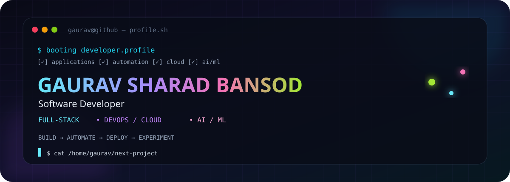
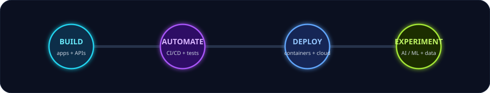
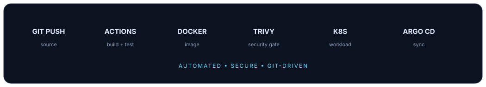
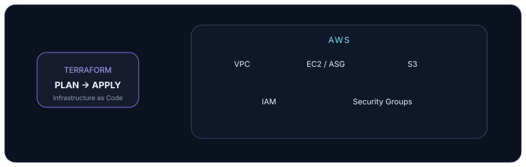
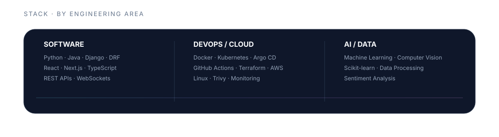

  

&nbsp;

&nbsp;

&nbsp;

 

## 
⚙️ About Me

<table>
<tr>
<td width="34%" align="center">

</td>
<td width="66%">

I'm **Gaurav Sharad Bansod**, a Computer Science and Engineering student at **VIT Bhopal University**, expected to graduate in 2027.

I build across the software lifecycle — from **full-stack applications and APIs** to **CI/CD, containers, cloud infrastructure, and AI/ML-powered systems**.

My strongest work sits where application engineering meets automation: building the software, then understanding how to ship it reliably.

</td>
</tr>
</table>

 

## 
🧭 How I Build

  

## 
🚀 Selected Work

<table>
<tr>
<td width="50%" valign="top">

### NITIGATI
**AI-Powered Freelance Service Marketplace**

Full-stack marketplace with Provider/Customer workflows, authentication, discovery, proposals, orders, real-time chat and an AI voice onboarding flow.

`Django` `DRF` `Next.js` `TypeScript` `WebSockets` `Redis`

<a href="https://github.com/Gauravb741/NITIGATI">View repository →</a>

 

</td>

<td width="50%" valign="top">

### GitOps Kubernetes Deployer
**Automated delivery from Git to Kubernetes**

GitHub Actions pipeline with build, unit testing, Docker image creation, Trivy security scanning and GitOps deployment through Argo CD.

`GitHub Actions` `Docker` `Trivy` `Kubernetes` `Argo CD`

<a href="https://github.com/Gauravb741/gitops-kubernetes-deployer">View repository →</a>

 

</td>
</tr>

<tr>
<td width="50%" valign="top">

### Terraform AWS Infrastructure
**Infrastructure as Code for AWS**

Modular AWS infrastructure covering VPC, EC2 Auto Scaling, S3, IAM and security groups, with a repeatable Terraform lifecycle.

`Terraform` `AWS` `VPC` `EC2` `IAM`

<a href="https://github.com/Gauravb741/tf-aws-infra">View repository →</a>

 

</td>

<td width="50%" valign="top">

### CAPE
**Online Examination Management Platform**

Full-stack examination platform with Admin/Student roles, REST APIs, exam scheduling, records, study materials, analytics and data processing.

`Django REST` `React` `MongoDB` `Chart.js`

<a href="https://github.com/Gauravb741/CAPE">View repository →</a>

 

</td>
</tr>
</table>

  

## 
📊 GitHub Activity

  

  

## 
🛠️ Technologies

 

  

## 
💼 Experience

**MPonline Ltd.** · Advanced Software Engineering & Development Internship  
*May 2026 – July 2026*

Library Management System using MVC architecture for cataloguing, borrowing and returns.

 

**MPonline Ltd.** · AI / ML Internship  
*May 2026 – July 2026*

Smart Customer Retail System covering churn prediction, sentiment analysis and a conversational chatbot.

  

## 
✦ Milestones

|  | |
|:---:|:---|
| ◈ | **Patent** — “In-Display Fingerprint Mouse” · Design No. 434354-001 |
| ★ | **1st Place** — IEEE Ideathon competition |
| ✦ | **Author** — *WORDS FALLEN WRONG*, self-published July 2025 |

  

## 
📚 Certifications

`Google IT Support` &nbsp; `Networking — Google / Coursera` &nbsp; `AWS Cloud Practitioner` &nbsp; `Machine Learning — NPTEL / IIT`

  

## 
🌐 Connect

<a href="https://github.com/Gauravb741">GitHub</a>
&nbsp; · &nbsp;
<a href="https://linkedin.com/in/gauravbansod">LinkedIn</a>
&nbsp; · &nbsp;
<a href="https://gaurav-sharad-bansod.vercel.app/">Portfolio</a>
&nbsp; · &nbsp;
<a href="mailto:gauravbansod680@gmail.com">Email</a>

  

Build something useful. Make it reliable. Keep learning.

